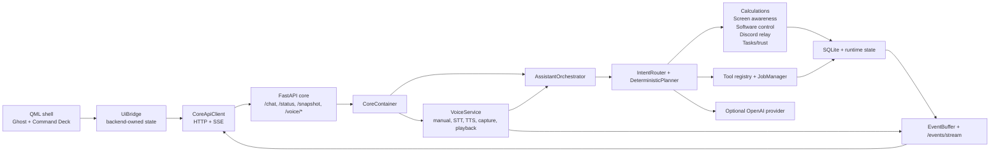

# Stormhelm Documentation

Stormhelm is a local-first desktop assistant for Windows. In this repository, it is implemented as a local FastAPI core plus a PySide6/QML shell. The core owns routing, safety, storage, jobs, events, tools, trust decisions, and subsystem execution. The UI renders backend-owned state and sends requests back to the core.

This documentation is derived from the repository as inspected during the rewrite. Older phase books and planning docs are treated as historical source material, not as the current product manual.

## What Exists Now

Implemented in the current source tree:

- Local FastAPI core API on `127.0.0.1:8765`.
- PySide6/QML shell with Ghost Mode, Command Deck surfaces, tray behavior, bridge state, and event-stream reconciliation.
- Deterministic assistant path with legacy slash commands, planner-driven route families, tool execution, and optional OpenAI provider fallback.
- SQLite-backed conversations, notes, tool runs, workspace state, durable task state, trust approvals, and semantic memory records.
- Local tools for time, system state, files, notes, browser/file handoff, app/window/system control, operational diagnostics, workspace operations, and weather/location.
- Bounded subsystems for calculations, screen awareness, software-control planning, software recovery, Discord relay preview/dispatch, task continuity, trust, lifecycle/startup, voice input/output, and event streaming.

Sources: `src/stormhelm/core/api/app.py`, `src/stormhelm/core/container.py`, `src/stormhelm/core/orchestrator/assistant.py`, `src/stormhelm/core/tools/builtins/__init__.py`, `src/stormhelm/core/voice/service.py`, `src/stormhelm/ui/app.py`, `src/stormhelm/ui/bridge.py`, `src/stormhelm/ui/client.py`
Tests: `tests/test_core_container.py`, `tests/test_assistant_orchestrator.py`, `tests/test_tool_registry.py`, `tests/test_voice_config.py`, `tests/test_voice_manual_turn.py`, `tests/test_ui_bridge.py`, `tests/test_ui_client_streaming.py`

## Important Boundaries

| Area | Current truth |
|---|---|
| Local-first | Core, UI, routing, tools, storage, events, calculations, trust, and most subsystems run locally. |
| OpenAI | Disabled by default. Provider fallback requires `OPENAI_API_KEY` and `STORMHELM_OPENAI_ENABLED=true`. |
| Shell execution | `shell_command` is disabled by default and the implemented path is a stub, not unrestricted shell execution. |
| Software installs | The subsystem can resolve targets, build plans, verify some installed apps, and launch via native app control. Install/update/uninstall/repair execution is approval-gated and currently falls to recovery when execution adapters are unavailable. |
| Screen awareness | Implemented as native/context observation, deterministic interpretation, grounding, verification, and gated action support. It is not a promise of full visual computer-use autonomy. |
| Discord relay | Implemented around trusted aliases, preview fingerprints, payload provenance, local client automation, trust prompts, duplicate suppression, and limited verification. Official bot/webhook routes are disabled by default. |
| Voice | Implemented but limited and disabled by default. It supports typed manual voice turns, controlled audio STT, controlled TTS artifact generation, explicit push-to-talk capture boundaries, playback-provider boundaries, diagnostics, events, and UI bridge actions. It does not implement wake word, always-listening, Realtime sessions, VAD, full interruption, or independent command authority. |
| Windows | UI shell, hotkeys, tray, native app/window/system control, Discord local automation, and lifecycle startup integration are Windows-oriented. |
| Safety | Destructive or external actions go through safety policy, trust decisions, adapter contracts, or explicit confirmation flows. |

Sources: `config/default.toml`, `src/stormhelm/config/loader.py`, `src/stormhelm/core/safety/policy.py`, `src/stormhelm/core/trust/service.py`, `src/stormhelm/core/software_control/service.py`, `src/stormhelm/core/discord_relay/service.py`, `src/stormhelm/core/voice/availability.py`, `src/stormhelm/core/voice/service.py`, `src/stormhelm/ui/ghost_input.py`
Tests: `tests/test_config_loader.py`, `tests/test_safety.py`, `tests/test_trust_service.py`, `tests/test_software_control.py`, `tests/test_discord_relay.py`, `tests/test_voice_availability.py`, `tests/test_ghost_input.py`

## Quick Start

Install from source:

```powershell
py -3.11 -m venv .venv
.\.venv\Scripts\Activate.ps1
python -m pip install -e .[dev,packaging]
```

Run the core:

```powershell
.\scripts\run_core.ps1
```

Run the UI:

```powershell
.\scripts\run_ui.ps1
```

Launch both for development:

```powershell
.\scripts\dev_launch.ps1
```

Check the local API:

```powershell
curl http://127.0.0.1:8765/health
curl http://127.0.0.1:8765/status
curl http://127.0.0.1:8765/settings
curl http://127.0.0.1:8765/tools
```

Sources: `scripts/run_core.ps1`, `scripts/run_ui.ps1`, `scripts/dev_launch.ps1`, `src/stormhelm/entrypoints/core.py`, `src/stormhelm/entrypoints/ui.py`, `src/stormhelm/core/api/app.py`
Tests: `tests/test_launcher.py`, `tests/test_config_loader.py`

## Documentation Map

| Need | Page |
|---|---|
| What Stormhelm can do | [features.md](features.md) |
| How to use it day to day | [usage.md](usage.md) |
| Slash commands and natural-language route families | [commands.md](commands.md) |
| Runtime architecture | [architecture.md](architecture.md) |
| Stored state and typed models | [data-model.md](data-model.md) |
| Config, environment variables, and feature flags | [settings.md](settings.md) |
| Ghost, Command Deck, bridge, QML surfaces | [ui-surfaces.md](ui-surfaces.md) |
| Voice user guide | [voice.md](voice.md) |
| Planner, routing, route state, fuzzy evaluation | [planner-routing.md](planner-routing.md) |
| Subsystem responsibilities | [subsystems.md](subsystems.md) |
| OpenAI, Discord, Qt, Windows, storage, package manager integrations | [integrations.md](integrations.md) |
| Approval, secrets, local-first behavior, data retention | [security-and-trust.md](security-and-trust.md) |
| Setup, tests, adding routes/adapters/settings/UI | [development.md](development.md) |
| Test/evaluation matrix | [testing-evaluation.md](testing-evaluation.md) |
| Common failures and fixes | [troubleshooting.md](troubleshooting.md) |
| End-to-end examples | [examples.md](examples.md) |
| Implemented vs planned | [roadmap.md](roadmap.md) |
| Voice foundation and developer boundaries | [voice-0-foundation.md](voice-0-foundation.md) |
| Historical phase docs index | [archive/phase-documents.md](archive/phase-documents.md) |

## Runtime Flow



Sources: `src/stormhelm/core/api/app.py`, `src/stormhelm/core/container.py`, `src/stormhelm/core/orchestrator/assistant.py`, `src/stormhelm/core/orchestrator/planner.py`, `src/stormhelm/core/voice/service.py`, `src/stormhelm/core/events.py`, `src/stormhelm/ui/client.py`, `src/stormhelm/ui/bridge.py`
Tests: `tests/test_events.py`, `tests/test_ui_client_streaming.py`, `tests/test_assistant_orchestrator.py`, `tests/test_planner.py`, `tests/test_voice_core_bridge_contracts.py`

## KGFS Style Reference

This rewrite follows the practical documentation style requested from the KGFS docs: repo-derived, source-referenced, command-oriented, split by reader need, and explicit about implemented vs planned behavior. Reference: https://github.com/Kgray44/KG-File-Search/tree/main/docs
