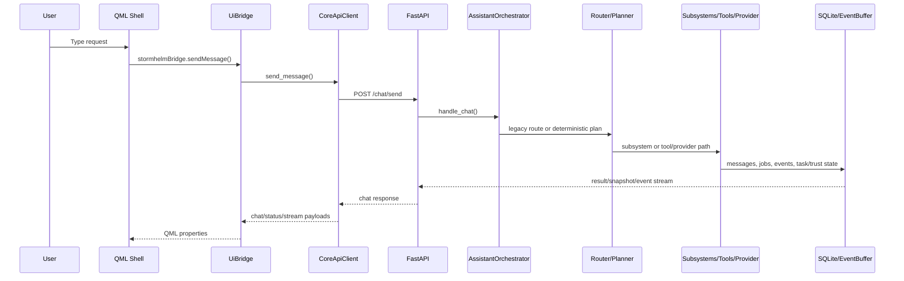
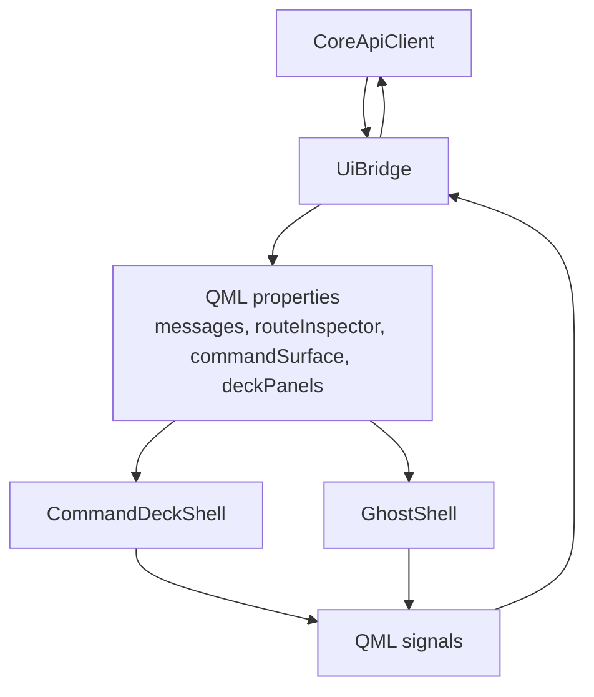

# Architecture

Stormhelm is split into a local core service and a desktop shell. The core is the authority for state, safety, routing, persistence, events, and subsystem execution. The UI renders and acts on core-owned state.

## Package Layout

| Path | Role |
|---|---|
| `src/stormhelm/core/api` | FastAPI app and API schemas. |
| `src/stormhelm/core/orchestrator` | Assistant orchestration, legacy router, deterministic planner, route models, browser destination resolver, fuzzy eval support. |
| `src/stormhelm/core/tools` | Tool descriptors, registry, executor, built-in local tools. |
| `src/stormhelm/core/jobs` | Bounded async job manager and job records. |
| `src/stormhelm/core/events.py` | Event records, bounded replay buffer, stream support. |
| `src/stormhelm/core/memory` | SQLite schema, repositories, semantic memory service. |
| `src/stormhelm/core/tasks` | Durable task graph and continuity state. |
| `src/stormhelm/core/trust` | Approval requests, grants, audit records. |
| `src/stormhelm/core/safety` | Tool/file/software safety gates. |
| `src/stormhelm/core/calculations` | Deterministic calculations subsystem. |
| `src/stormhelm/core/screen_awareness` | Screen observation, interpretation, grounding, action, verification, problem-solving, workflow learning. |
| `src/stormhelm/core/software_control` | Software target catalog, planner seam, operation planning/execution status. |
| `src/stormhelm/core/software_recovery` | Local/cloud-advisory recovery planning. |
| `src/stormhelm/core/discord_relay` | Discord alias/payload/preview/dispatch subsystem. |
| `src/stormhelm/core/system`, `core/network`, `core/power`, `core/operations` | Machine state, native control, telemetry, diagnostics. |
| `src/stormhelm/config` | TOML/env loader and dataclass config models. |
| `src/stormhelm/ui` | PySide app, bridge, client, controller, tray, Ghost adaptation. |
| `assets/qml` | Ghost, Command Deck, panels, browser/file surfaces, route inspector, visual layers. |
| `scripts` | Source launch and packaging scripts. |
| `tests` | Unit/integration/QML/contract tests. |

Sources: `git ls-files`, `pyproject.toml`, `src/stormhelm/core/container.py`, `src/stormhelm/ui/app.py`  
Tests: `tests/test_core_container.py`, `tests/test_qml_shell.py`, `tests/test_launcher.py`

## Runtime Flow

Sources: `src/stormhelm/ui/bridge.py`, `src/stormhelm/ui/client.py`, `src/stormhelm/ui/controllers/main_controller.py`, `src/stormhelm/core/api/app.py`, `src/stormhelm/core/orchestrator/assistant.py`, `src/stormhelm/core/orchestrator/planner.py`  
Tests: `tests/test_main_controller.py`, `tests/test_ui_client_streaming.py`, `tests/test_assistant_orchestrator.py`, `tests/test_planner.py`

## Core Container

`CoreContainer` wires the runtime. It builds config-dependent services, starts/stops lifecycle state, initializes SQLite, starts jobs and network monitoring, and produces status/snapshot payloads.

Owned services include:

- Config and runtime paths.
- Event buffer.
- SQLite database and repositories.
- Semantic memory service.
- Conversation state store.
- System probe and network monitor.
- Safety policy and trust service.
- Tool registry/executor and job manager.
- Lifecycle controller.
- Optional OpenAI provider.
- Calculations, screen awareness, software control/recovery, Discord relay.
- Durable task service.
- Workspace/environment/context/judgment/operations services.

Sources: `src/stormhelm/core/container.py`, `src/stormhelm/core/runtime_state.py`, `src/stormhelm/core/events.py`, `src/stormhelm/core/memory/database.py`  
Tests: `tests/test_core_container.py`, `tests/test_runtime_state.py`, `tests/test_snapshot_resilience.py`

## Orchestrator Flow

`AssistantOrchestrator` handles `/chat/send`:

1. Persist the user message.
2. Try the legacy `IntentRouter` for slash commands and explicit command surfaces.
3. Update active workspace/session context.
4. Ask the deterministic planner for route state and execution plan.
5. Execute direct subsystem paths for calculations, screen awareness, software control, Discord relay, recovery, and workspace continuity.
6. Otherwise submit local tool jobs or optional provider fallback.
7. Persist assistant response and publish events.

Sources: `src/stormhelm/core/orchestrator/assistant.py`, `src/stormhelm/core/orchestrator/router.py`, `src/stormhelm/core/orchestrator/planner.py`, `src/stormhelm/core/orchestrator/planner_models.py`  
Tests: `tests/test_assistant_orchestrator.py`, `tests/test_planner.py`, `tests/test_planner_structured_pipeline.py`

## Planner Flow

The deterministic planner combines normalized request shape, route-family logic, active request state, deictic/follow-up context, feature flags, and subsystem planner seams. It should return a truthful route posture rather than sending native-capable requests into generic provider fallback.

Tracked route-support sources include:

- Legacy router: `src/stormhelm/core/orchestrator/router.py`
- Planner models: `src/stormhelm/core/orchestrator/planner_models.py`
- Main planner: `src/stormhelm/core/orchestrator/planner.py`
- Browser destinations: `src/stormhelm/core/orchestrator/browser_destinations.py`
- Fuzzy eval: `src/stormhelm/core/orchestrator/fuzzy_eval/*`

Active worktree note: route-v2 files were present during this rewrite but not listed by `git ls-files`. Treat route-v2-specific guarantees as needs-verification until those files are intentionally added to the repository.

Sources: `src/stormhelm/core/orchestrator/planner.py`, `src/stormhelm/core/orchestrator/planner_models.py`, `src/stormhelm/core/orchestrator/browser_destinations.py`, `src/stormhelm/core/orchestrator/fuzzy_eval/runner.py`  
Tests: `tests/test_planner.py`, `tests/test_browser_destination_resolution.py`, `tests/test_fuzzy_language_evaluation.py`

## Bridge / UI Flow

The bridge exposes QML properties and methods. It can submit messages, update local layout, open local surfaces through actions, and display pending approvals. Backend authority remains in the core.

Sources: `src/stormhelm/ui/client.py`, `src/stormhelm/ui/bridge.py`, `src/stormhelm/ui/command_surface_v2.py`, `assets/qml/Main.qml`, `assets/qml/components/GhostShell.qml`, `assets/qml/components/CommandDeckShell.qml`  
Tests: `tests/test_ui_bridge.py`, `tests/test_ui_bridge_authority_contracts.py`, `tests/test_command_surface.py`, `tests/test_qml_shell.py`

## Subsystem Boundaries

| Subsystem | Owns | Does not own |
|---|---|---|
| Calculations | Local parse/evaluate/format/trace. | General math reasoning outside implemented parser/helper scope. |
| Screen awareness | Current context observation, interpretation, grounding, verification, gated action result. | Unlimited screen control or surveillance. |
| Software control | Target resolution, plans, checkpoints, verification/launch attempts. | Claiming installation success without execution and verification. |
| Software recovery | Failure classification and bounded recovery plans. | Final repair claims without verification. |
| Discord relay | Destination/payload resolution, preview, dispatch attempt, provenance, duplicate/stale checks. | Official Discord bot delivery by default. |
| Trust | Approval/grant/audit state. | UI-only confirmation without backend decision. |
| Tasks | Durable task state and continuity. | Workspace fallback masquerading as durable task memory. |
| UI bridge | Presentation state and local UI actions. | Backend truth or safety policy. |

Sources: `src/stormhelm/core/calculations/service.py`, `src/stormhelm/core/screen_awareness/service.py`, `src/stormhelm/core/software_control/service.py`, `src/stormhelm/core/software_recovery/service.py`, `src/stormhelm/core/discord_relay/service.py`, `src/stormhelm/core/trust/service.py`, `src/stormhelm/core/tasks/service.py`, `src/stormhelm/ui/bridge.py`  
Tests: `tests/test_calculations.py`, `tests/test_screen_awareness_service.py`, `tests/test_software_control.py`, `tests/test_software_recovery.py`, `tests/test_discord_relay.py`, `tests/test_trust_service.py`, `tests/test_task_graph.py`

## Adapter Boundaries

Adapter contracts describe whether a tool/action has preview, approval, verification, rollback, and trust-tier metadata. The safety policy and tool executor use contract status to avoid executing invalid adapter routes.

Sources: `src/stormhelm/core/adapters/contracts.py`, `src/stormhelm/core/tools/executor.py`, `src/stormhelm/core/safety/policy.py`  
Tests: `tests/test_adapter_contracts.py`, `tests/test_safety.py`

## Configuration Loading

Config load order:

1. `config/default.toml`
2. optional local development TOML file copied from `config/development.toml.example`
3. portable/user config paths when running packaged
4. explicit config path when provided
5. `.env`
6. process environment overrides

Runtime paths default under `%LOCALAPPDATA%\Stormhelm` unless storage paths are configured.

Sources: `src/stormhelm/config/loader.py`, `src/stormhelm/config/models.py`, `config/default.toml`, `config/development.toml.example`  
Tests: `tests/test_config_loader.py`

## Persistence And Storage Paths

Stormhelm uses SQLite for durable application state. Runtime state files track lifecycle, core state, session state, first-run markers, and layout/local state.

SQLite table families:

- conversation sessions/messages
- notes
- tool runs
- preferences
- workspace state
- task graph state
- trust approval/grant/audit records
- semantic memory records/query logs

Sources: `src/stormhelm/core/memory/database.py`, `src/stormhelm/core/memory/repositories.py`, `src/stormhelm/core/runtime_state.py`, `src/stormhelm/shared/paths.py`  
Tests: `tests/test_storage.py`, `tests/test_runtime_state.py`, `tests/test_workspace_service.py`, `tests/test_task_graph.py`, `tests/test_trust_service.py`, `tests/test_semantic_memory.py`

## External Integrations

| Integration | Boundary |
|---|---|
| OpenAI Responses API | Optional, disabled by default, used through provider abstraction only when key/enabled. |
| Discord local client | Local Windows automation route for trusted aliases; preview/trust/fingerprint required. |
| Qt/PySide/QML | UI shell and surfaces. |
| Windows APIs | Hotkeys, tray/window behavior, app/window/system control, startup registry. |
| Open-Meteo | Weather provider default when weather enabled. |
| HWiNFO/helper telemetry | Optional hardware telemetry path. |
| PyInstaller/Inno Setup | Packaging. |

Sources: `src/stormhelm/core/providers/openai_responses.py`, `src/stormhelm/core/discord_relay/adapters.py`, `src/stormhelm/ui/app.py`, `src/stormhelm/ui/ghost_input.py`, `src/stormhelm/core/system/probe.py`, `src/stormhelm/core/tools/builtins/system_state.py`, `scripts/package_portable.ps1`, `scripts/package_installer.ps1`  
Tests: `tests/test_discord_relay.py`, `tests/test_windows_effects.py`, `tests/test_ghost_input.py`, `tests/test_system_probe.py`, `tests/test_hardware_telemetry.py`
