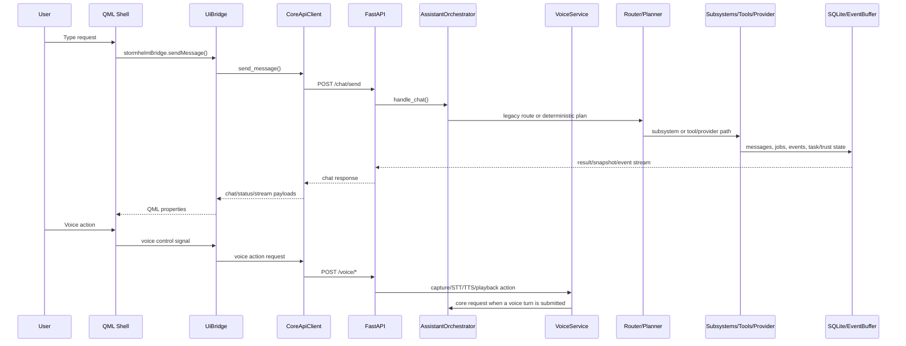
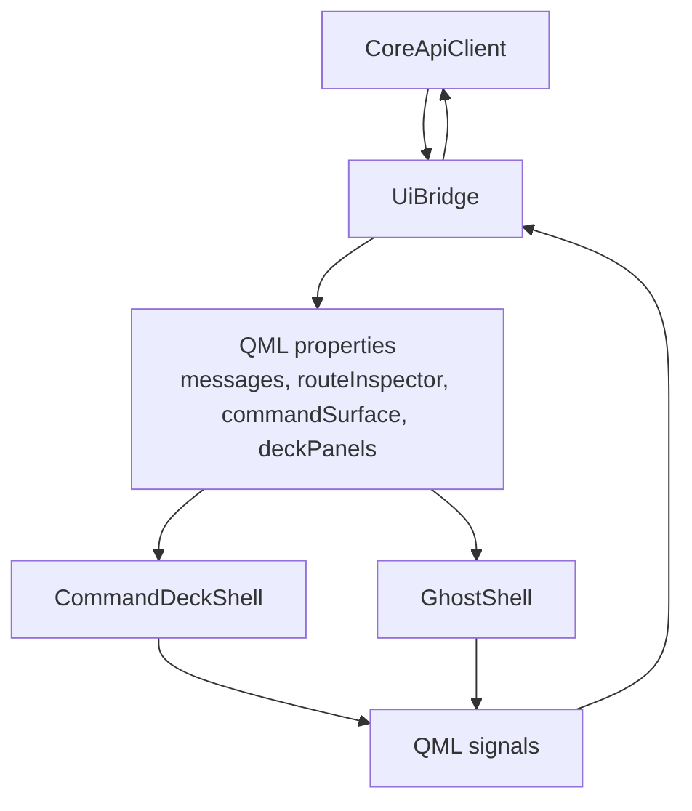

# Architecture

Stormhelm is split into a local core service and a desktop shell. The core is the authority for state, safety, routing, persistence, events, and subsystem execution. The UI renders and acts on core-owned state.

## Package Layout

| Path | Role |
|---|---|
| `src/stormhelm/core/api` | FastAPI app and API schemas. |
| `src/stormhelm/core/orchestrator` | Assistant orchestration, legacy router, deterministic planner, route models, browser destination resolver, fuzzy eval support. |
| `src/stormhelm/core/tools` | Tool descriptors, registry, executor, built-in local tools. |
| `src/stormhelm/core/jobs` | Bounded async job manager and job records. |
| `src/stormhelm/core/events.py` | Event records, bounded replay buffer, stream support. |
| `src/stormhelm/core/memory` | SQLite schema, repositories, semantic memory service. |
| `src/stormhelm/core/tasks` | Durable task graph and continuity state. |
| `src/stormhelm/core/trust` | Approval requests, grants, audit records. |
| `src/stormhelm/core/safety` | Tool/file/software safety gates. |
| `src/stormhelm/core/calculations` | Deterministic calculations subsystem. |
| `src/stormhelm/core/screen_awareness` | Screen observation, interpretation, grounding, action, verification, problem-solving, workflow learning, semantic adapter registry ownership, and disabled-by-default Playwright browser semantic readiness, mock observation, opt-in isolated live semantic snapshot extraction, semantic candidate ranking, guidance-only browser target grounding, semantic comparison, action previews, and trust-gated click/focus execution through canonical Screen Awareness paths. |
| `src/stormhelm/core/software_control` | Software target catalog, planner seam, operation planning/execution status. |
| `src/stormhelm/core/software_recovery` | Local/cloud-advisory recovery planning. |
| `src/stormhelm/core/web_retrieval` | Public URL safety including redirect checks, HTTP/Obscura CLI/Obscura CDP retrieval providers, managed headless CDP sessions, compatibility probing, evidence bundles, and trace models. |
| `src/stormhelm/core/live_browser_integration.py` | Opt-in live Obscura/Playwright provider diagnostics, gated by environment variables and safe report boundaries. |
| `src/stormhelm/core/discord_relay` | Discord alias/payload/preview/dispatch subsystem. |
| `src/stormhelm/core/voice` | Disabled-by-default voice config/state, manual turns, controlled STT/TTS, capture/playback boundaries, diagnostics, and events. |
| `src/stormhelm/core/system`, `core/network`, `core/power`, `core/operations` | Machine state, native control, telemetry, diagnostics. |
| `src/stormhelm/config` | TOML/env loader and dataclass config models. |
| `src/stormhelm/ui` | PySide app, bridge, client, controller, tray, Ghost adaptation, voice UI state shaping. |
| `assets/qml` | Ghost, Command Deck, panels, browser/file surfaces, route inspector, visual layers. |
| `scripts` | Source launch and packaging scripts. |
| `tests` | Unit/integration/QML/contract tests. |

Sources: `git ls-files`, `pyproject.toml`, `src/stormhelm/core/container.py`, `src/stormhelm/core/voice/service.py`, `src/stormhelm/ui/app.py`, `src/stormhelm/ui/voice_surface.py`
Tests: `tests/test_core_container.py`, `tests/test_voice_config.py`, `tests/test_voice_state.py`, `tests/test_qml_shell.py`, `tests/test_launcher.py`

## Runtime Flow

Sources: `src/stormhelm/ui/bridge.py`, `src/stormhelm/ui/client.py`, `src/stormhelm/ui/controllers/main_controller.py`, `src/stormhelm/core/api/app.py`, `src/stormhelm/core/orchestrator/assistant.py`, `src/stormhelm/core/orchestrator/planner.py`, `src/stormhelm/core/voice/service.py`
Tests: `tests/test_main_controller.py`, `tests/test_ui_client_streaming.py`, `tests/test_assistant_orchestrator.py`, `tests/test_planner.py`, `tests/test_voice_bridge_controls.py`, `tests/test_voice_core_bridge_contracts.py`

## Core Container

`CoreContainer` wires the runtime. It builds config-dependent services, starts/stops lifecycle state, initializes SQLite, starts jobs and network monitoring, and produces status/snapshot payloads.

Owned services include:

- Config and runtime paths.
- Event buffer.
- SQLite database and repositories.
- Semantic memory service.
- Conversation state store.
- System probe and network monitor.
- Safety policy and trust service.
- Tool registry/executor and job manager.
- Lifecycle controller.
- Optional OpenAI provider.
- Calculations, screen awareness, software control/recovery, Discord relay.
- Voice service with typed manual turns, controlled STT/TTS, capture/playback providers, diagnostics, and status snapshot.
- Durable task service.
- Workspace/environment/context/judgment/operations services.

Sources: `src/stormhelm/core/container.py`, `src/stormhelm/core/runtime_state.py`, `src/stormhelm/core/events.py`, `src/stormhelm/core/memory/database.py`, `src/stormhelm/core/voice/service.py`
Tests: `tests/test_core_container.py`, `tests/test_runtime_state.py`, `tests/test_snapshot_resilience.py`, `tests/test_voice_state.py`

## Orchestrator Flow

`AssistantOrchestrator` handles `/chat/send`:

1. Persist the user message.
2. Try the legacy `IntentRouter` for slash commands and explicit command surfaces.
3. Update active workspace/session context.
4. Ask the deterministic planner for route state and execution plan.
5. Execute direct subsystem paths for calculations, screen awareness, software control, Discord relay, recovery, and workspace continuity.
6. Otherwise submit local tool jobs or optional provider fallback.
7. Persist assistant response and publish events.

Sources: `src/stormhelm/core/orchestrator/assistant.py`, `src/stormhelm/core/orchestrator/router.py`, `src/stormhelm/core/orchestrator/planner.py`, `src/stormhelm/core/orchestrator/planner_models.py`
Tests: `tests/test_assistant_orchestrator.py`, `tests/test_planner.py`, `tests/test_planner_structured_pipeline.py`

## Planner Flow

The deterministic planner combines normalized request shape, route-family logic, active request state, deictic/follow-up context, feature flags, and subsystem planner seams. It should return a truthful route posture rather than sending native-capable requests into generic provider fallback.

Tracked route-support sources include:

- Legacy router: `src/stormhelm/core/orchestrator/router.py`
- Planner models: `src/stormhelm/core/orchestrator/planner_models.py`
- Main planner: `src/stormhelm/core/orchestrator/planner.py`
- Browser destinations: `src/stormhelm/core/orchestrator/browser_destinations.py`
- Web retrieval: `src/stormhelm/core/web_retrieval/*`
- Fuzzy eval: `src/stormhelm/core/orchestrator/fuzzy_eval/*`

Active worktree note: route-v2 files were present during this rewrite but not listed by `git ls-files`. Treat route-v2-specific guarantees as needs-verification until those files are intentionally added to the repository.

Sources: `src/stormhelm/core/orchestrator/planner.py`, `src/stormhelm/core/orchestrator/planner_models.py`, `src/stormhelm/core/orchestrator/browser_destinations.py`, `src/stormhelm/core/orchestrator/fuzzy_eval/runner.py`
Tests: `tests/test_planner.py`, `tests/test_browser_destination_resolution.py`, `tests/test_fuzzy_language_evaluation.py`

## Bridge / UI Flow

The bridge exposes QML properties and methods. It can submit messages, update local layout, open local surfaces through actions, and display pending approvals. Backend authority remains in the core.

Sources: `src/stormhelm/ui/client.py`, `src/stormhelm/ui/bridge.py`, `src/stormhelm/ui/command_surface_v2.py`, `assets/qml/Main.qml`, `assets/qml/components/GhostShell.qml`, `assets/qml/components/CommandDeckShell.qml`
Tests: `tests/test_ui_bridge.py`, `tests/test_ui_bridge_authority_contracts.py`, `tests/test_command_surface.py`, `tests/test_qml_shell.py`

## Subsystem Boundaries

| Subsystem | Owns | Does not own |
|---|---|---|
| Calculations | Local parse/evaluate/format/trace. | General math reasoning outside implemented parser/helper scope. |
| Screen awareness | Current context observation, interpretation, semantic adapter resolution, grounding, verification, gated action result, optional Playwright browser semantic readiness/mock observations, opt-in isolated Playwright semantic snapshot extraction, semantic target ranking, before/after semantic comparison, browser action previews, trust-gated click/focus execution, and trust-gated safe-field `type_text` execution through isolated temporary contexts only. Playwright observations feed the canonical browser adapter payload, canonical grounding uses the resulting adapter-semantic targets, and Playwright execution results map back into canonical action-result summaries; regression tests assert planner/UI code cannot bypass that spine. | Unlimited screen control or surveillance, direct Playwright command authority, live Playwright automation in normal CI, user-profile browser control, unsafe typing/scroll/form/login/cookie/payment/CAPTCHA automation, visible-screen verification, truth verification, or browser action execution outside explicit trust/verification contracts. |
| Software control | Target resolution, plans, checkpoints, verification/launch attempts. | Claiming installation success without execution and verification. |
| Software recovery | Failure classification and bounded recovery plans. | Final repair claims without verification. |
| Discord relay | Destination/payload resolution, preview, dispatch attempt, provenance, duplicate/stale checks. | Official Discord bot delivery by default. |
| Trust | Approval/grant/audit state. | UI-only confirmation without backend decision. |
| Tasks | Durable task state and continuity. | Workspace fallback masquerading as durable task memory. |
| Voice | Manual voice turns, controlled STT/TTS, explicit capture/playback state, diagnostics, and voice events. | Wake word, always-listening, Realtime, VAD, direct tool execution, or bypassing trust/safety. |
| Web retrieval | Public URL safety validation, final redirect safety checks, HTTP extraction, optional Obscura CLI rendering/extraction, optional Obscura CDP localhost managed sessions for headless title/final URL/DOM/link/network/console inspection, endpoint compatibility probing, evidence bundles, traces, fallback provenance, typed provider failures, and opt-in live provider diagnostics. | Browser opening, Playwright/Puppeteer replacement behavior, CDP input actions, logged-in context, cookies/session reuse, form/click/type/scroll automation, CAPTCHA/anti-bot bypass, independent truth checking, or claims about the user's visible screen. |
| UI bridge | Presentation state and local UI actions. | Backend truth or safety policy. |

Sources: `src/stormhelm/core/calculations/service.py`, `src/stormhelm/core/screen_awareness/service.py`, `src/stormhelm/core/software_control/service.py`, `src/stormhelm/core/software_recovery/service.py`, `src/stormhelm/core/web_retrieval/service.py`, `src/stormhelm/core/discord_relay/service.py`, `src/stormhelm/core/trust/service.py`, `src/stormhelm/core/tasks/service.py`, `src/stormhelm/core/voice/service.py`, `src/stormhelm/ui/bridge.py`
Tests: `tests/test_calculations.py`, `tests/test_screen_awareness_service.py`, `tests/test_software_control.py`, `tests/test_software_recovery.py`, `tests/test_web_retrieval_service.py`, `tests/test_discord_relay.py`, `tests/test_trust_service.py`, `tests/test_task_graph.py`, `tests/test_voice_manual_turn.py`, `tests/test_voice_audio_turn.py`

## Adapter Boundaries

Adapter contracts describe whether a tool/action has preview, approval, verification, rollback, and trust-tier metadata. The safety policy and tool executor use contract status to avoid executing invalid adapter routes. `web_retrieval.obscura.cli` is registered as an external-network/local-process adapter with preview support, no approval requirement, no rollback, and a maximum claim of observed rendered-page evidence. `web_retrieval.obscura.cdp` is registered separately as a localhost managed-session adapter with the `headless_cdp_page_evidence` ceiling and no declared browser input, cookie, visible-screen, truth-verification, or Playwright capabilities. CDP endpoint discovery treats `/json/version`, `/json/list`, `/json`, websocket host/scheme mismatches, malformed/non-JSON responses, timeouts, and connection refusal as typed compatibility states instead of assuming Chrome-perfect behavior. `screen_awareness.browser.playwright` is a Screen Awareness contract with observation, grounding, comparison, preview, and runtime-gated click/focus/safe-field typing posture; Playwright plugs into `SemanticAdapterRegistry` as browser semantics and into `DeterministicActionEngine` result mapping rather than becoming a planner/UI authority. Addition 5.3 preserves that boundary with route-pressure and source-audit tests: browser-control questions/actions route to Screen Awareness, URL summarization stays Web Retrieval, browser opening stays Browser Destination, relay stays Discord, and no planner/UI module calls Playwright execution directly. Addition 5 exposes click/focus only through config/readiness status and trust approval; Addition 6 exposes `browser.input.type_text` only through separate safe-field type gates, exact trust approval, and redacted text binding. Scroll, form, login, cookie, payment, download, visible-screen, truth-verification, and workflow-replay capabilities remain undeclared.

Sources: `src/stormhelm/core/adapters/contracts.py`, `src/stormhelm/core/tools/executor.py`, `src/stormhelm/core/safety/policy.py`
Tests: `tests/test_adapter_contracts.py`, `tests/test_safety.py`, `tests/test_screen_awareness_playwright_adapter_integration.py`, `tests/test_screen_awareness_playwright_canonical_kraken.py`, `tests/test_screen_awareness_playwright_live_semantic.py`

## Configuration Loading

Config load order:

1. `config/default.toml`
2. optional local development TOML file copied from `config/development.toml.example`
3. portable/user config paths when running packaged
4. explicit config path when provided
5. `.env`
6. process environment overrides

Runtime paths default under `%LOCALAPPDATA%\Stormhelm` unless storage paths are configured.

Sources: `src/stormhelm/config/loader.py`, `src/stormhelm/config/models.py`, `config/default.toml`, `config/development.toml.example`
Tests: `tests/test_config_loader.py`

## Persistence And Storage Paths

Stormhelm uses SQLite for durable application state. Runtime state files track lifecycle, core state, session state, first-run markers, and layout/local state.

SQLite table families:

- conversation sessions/messages
- notes
- tool runs
- preferences
- workspace state
- task graph state
- trust approval/grant/audit records
- semantic memory records/query logs

Sources: `src/stormhelm/core/memory/database.py`, `src/stormhelm/core/memory/repositories.py`, `src/stormhelm/core/runtime_state.py`, `src/stormhelm/shared/paths.py`
Tests: `tests/test_storage.py`, `tests/test_runtime_state.py`, `tests/test_workspace_service.py`, `tests/test_task_graph.py`, `tests/test_trust_service.py`, `tests/test_semantic_memory.py`

## External Integrations

| Integration | Boundary |
|---|---|
| OpenAI Responses API | Optional, disabled by default, used through provider abstraction only when key/enabled. |
| OpenAI voice STT/TTS | Optional, disabled by default, used for controlled audio transcription and speech artifact generation when voice/OpenAI gates pass. |
| Discord local client | Local Windows automation route for trusted aliases; preview/trust/fingerprint required. |
| Qt/PySide/QML | UI shell and surfaces. |
| Windows APIs | Hotkeys, tray/window behavior, app/window/system control, startup registry. |
| Open-Meteo | Weather provider default when weather enabled. |
| HWiNFO/helper telemetry | Optional hardware telemetry path. |
| PyInstaller/Inno Setup | Packaging. |

Sources: `src/stormhelm/core/providers/openai_responses.py`, `src/stormhelm/core/voice/providers.py`, `src/stormhelm/core/discord_relay/adapters.py`, `src/stormhelm/ui/app.py`, `src/stormhelm/ui/ghost_input.py`, `src/stormhelm/core/system/probe.py`, `src/stormhelm/core/tools/builtins/system_state.py`, `scripts/package_portable.ps1`, `scripts/package_installer.ps1`
Tests: `tests/test_discord_relay.py`, `tests/test_voice_stt_provider.py`, `tests/test_voice_tts_provider.py`, `tests/test_windows_effects.py`, `tests/test_ghost_input.py`, `tests/test_system_probe.py`, `tests/test_hardware_telemetry.py`
