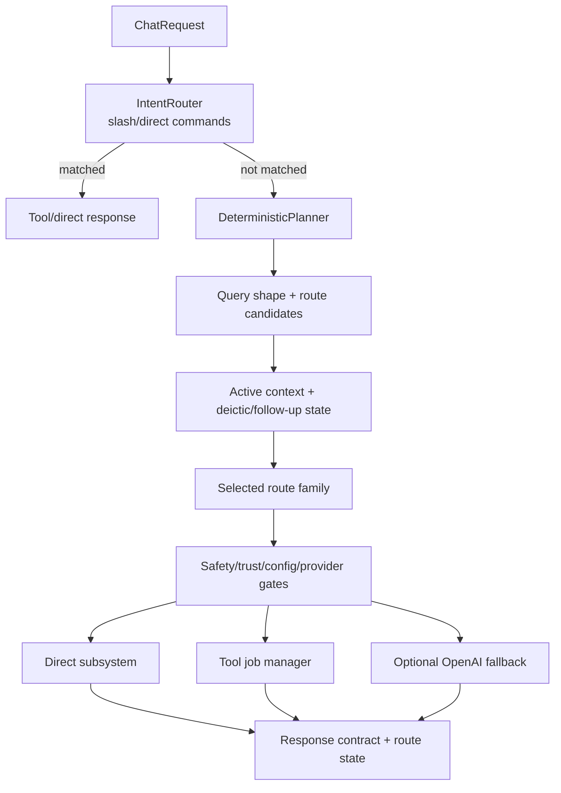

# Planner And Routing

Stormhelm routing is designed to prefer implemented local capabilities before generic provider fallback. The planner should be truthful about wrong-route risk, missing context, unsupported behavior, and approval/verification boundaries.

Sources: `src/stormhelm/core/orchestrator/assistant.py`, `src/stormhelm/core/orchestrator/router.py`, `src/stormhelm/core/orchestrator/planner.py`, `src/stormhelm/core/orchestrator/planner_models.py`
Tests: `tests/test_assistant_orchestrator.py`, `tests/test_planner.py`, `tests/test_planner_command_routing_state.py`

## Entry Points

| Entry point | Role | Sources | Tests |
|---|---|---|---|
| `POST /chat/send` | Main request entry. | `src/stormhelm/core/api/app.py`, `src/stormhelm/core/orchestrator/assistant.py` | `tests/test_assistant_orchestrator.py` |
| `IntentRouter.route()` | Legacy slash/direct command handling. | `src/stormhelm/core/orchestrator/router.py` | `tests/test_assistant_orchestrator.py` |
| `DeterministicPlanner` | Natural-language route classification and plan building. | `src/stormhelm/core/orchestrator/planner.py` | `tests/test_planner.py` |
| Subsystem planner seams | Feature-owned route evaluation. | `src/stormhelm/core/calculations/planner.py`, `src/stormhelm/core/software_control/planner.py`, `src/stormhelm/core/screen_awareness/planner.py` | `tests/test_calculations.py`, `tests/test_software_control.py`, `tests/test_screen_awareness_service.py` |
| Browser destination resolver | Browser/search/direct-domain routing. | `src/stormhelm/core/orchestrator/browser_destinations.py` | `tests/test_browser_destination_resolution.py` |

## Main Route Flow



Sources: `src/stormhelm/core/orchestrator/assistant.py`, `src/stormhelm/core/orchestrator/router.py`, `src/stormhelm/core/orchestrator/planner.py`, `src/stormhelm/core/safety/policy.py`
Tests: `tests/test_planner.py`, `tests/test_safety.py`

## Route Families

| Route family | Implemented path | Status | Sources | Tests |
|---|---|---|---|---|
| `legacy_command` | Slash commands in `IntentRouter`. | Implemented | `src/stormhelm/core/orchestrator/router.py` | `tests/test_assistant_orchestrator.py` |
| `calculations` | Calculation planner/service. | Implemented | `src/stormhelm/core/calculations/planner.py`, `src/stormhelm/core/calculations/service.py` | `tests/test_calculations.py` |
| `browser_destination` | Resolver and open tools. | Implemented | `src/stormhelm/core/orchestrator/browser_destinations.py`, `src/stormhelm/core/tools/builtins/workspace_actions.py` | `tests/test_browser_destination_resolution.py` |
| `screen_awareness` | Screen awareness subsystem. | Implemented but limited | `src/stormhelm/core/screen_awareness/service.py` | `tests/test_screen_awareness_service.py` |
| `screen_awareness_action` | Gated screen action engine. | Implemented but limited | `src/stormhelm/core/screen_awareness/action.py` | `tests/test_screen_awareness_action.py` |
| `software_control` | Software plan/verify/launch/recovery handoff. | Implemented but limited | `src/stormhelm/core/software_control/service.py` | `tests/test_software_control.py` |
| `software_recovery` | Recovery plan from failure event/context. | Implemented but limited | `src/stormhelm/core/software_recovery/service.py` | `tests/test_software_recovery.py` |
| `discord_relay` | Trusted alias preview/dispatch route. | Implemented but limited | `src/stormhelm/core/discord_relay/service.py` | `tests/test_discord_relay.py` |
| `task_continuity` | Durable task summary/next steps. | Implemented | `src/stormhelm/core/tasks/service.py` | `tests/test_task_graph.py` |
| `workspace_operations` | Workspace tools/service. | Implemented | `src/stormhelm/core/workspace/service.py`, `src/stormhelm/core/tools/builtins/workspace_memory.py` | `tests/test_workspace_service.py` |
| `trust_approvals` | Approval response handling. | Implemented | `src/stormhelm/core/trust/service.py` | `tests/test_trust_service.py` |
| `watch_runtime` | Status/events/diagnostics surfaces. | Implemented | `src/stormhelm/core/container.py`, `src/stormhelm/core/events.py` | `tests/test_operational_awareness.py` |
| `network`, `power`, `storage`, `resources`, `machine` | Built-in system tools. | Implemented | `src/stormhelm/core/tools/builtins/system_state.py` | `tests/test_system_probe.py`, `tests/test_network_analysis.py` |
| `app_control`, `window_control`, `system_control` | Native control tools through system probe/executor. | Implemented but limited | `src/stormhelm/core/tools/builtins/system_state.py`, `src/stormhelm/core/system/probe.py` | `tests/test_system_probe.py`, `tests/test_long_tail_power.py` |
| `semantic_memory` | Local memory service/retrieval. | Implemented but limited | `src/stormhelm/core/memory/service.py` | `tests/test_semantic_memory.py` |
| `generic_provider` | Optional OpenAI fallback. | Implemented but disabled by default | `src/stormhelm/core/providers/openai_responses.py`, `src/stormhelm/core/providers/base.py` | `tests/test_config_loader.py` |
| `voice_control` | Voice API/UI actions for explicit capture/playback plus voice turns entering the core bridge. | Implemented but limited | `src/stormhelm/core/voice/service.py`, `src/stormhelm/core/api/app.py`, `src/stormhelm/ui/bridge.py` | `tests/test_voice_bridge_controls.py`, `tests/test_voice_core_bridge_contracts.py` |

## Route Hypothesis Generation

The tracked planner uses structured route models such as:

- `QueryShape`
- `ResponseMode`
- `RoutePosture`
- `RouteTargetCandidate`
- `RequestDecomposition`
- `DeicticBindingCandidate`
- `RouteCandidate`
- `RoutingTelemetry`
- `ExecutionPlan`

These models are used to represent what the request appears to be, which route families are plausible, what context was bound, and why a route won or needs clarification.

Sources: `src/stormhelm/core/orchestrator/planner_models.py`, `src/stormhelm/core/orchestrator/planner.py`
Tests: `tests/test_planner_structured_pipeline.py`, `tests/test_planner_phase3c.py`

## Deictic And Follow-Up Resolution

Stormhelm needs to resolve terms like `this`, `that`, `it`, `same one`, and follow-up approvals. Current implemented consumers include:

- Discord relay payload resolution from active selection, active workspace item, clipboard, and recent entities.
- Software control confirmation stages through active request state and trust request ids.
- Screen awareness comparisons that require prior/current observations.
- Task continuity requests such as "where did we leave off".

Rules documented by current code:

- Current visible/active/selected context outranks stale recent artifacts for "this".
- Clipboard can be supporting evidence but must not impersonate the current screen.
- Stale Discord previews are invalidated by TTL, fingerprint mismatch, payload mutation, or destination changes.
- Trust grants are scoped and can expire or become invalid after runtime/task changes.
- Voice deictic behavior is intentionally narrow: speech-derived text enters the same core request path as typed text, while voice providers/capture controls do not resolve targets or execute tools themselves.

Sources: `src/stormhelm/core/discord_relay/service.py`, `src/stormhelm/core/screen_awareness/observation.py`, `src/stormhelm/core/screen_awareness/verification.py`, `src/stormhelm/core/software_control/service.py`, `src/stormhelm/core/trust/service.py`, `src/stormhelm/core/tasks/service.py`, `src/stormhelm/core/voice/bridge.py`, `src/stormhelm/core/voice/service.py`
Tests: `tests/test_discord_relay.py`, `tests/test_screen_awareness_phase12.py`, `tests/test_software_control.py`, `tests/test_trust_service.py`, `tests/test_task_graph.py`, `tests/test_voice_core_bridge_contracts.py`

## Route Scoring And Wrong-Route Risks

Wrong-route risks called out by the codebase and tests:

| Risk | Current mitigation | Sources | Tests |
|---|---|---|---|
| Calculation request falls into provider fallback. | Calculation planner/service owns deterministic math. | `src/stormhelm/core/calculations/planner.py`, `src/stormhelm/core/calculations/service.py` | `tests/test_calculations.py` |
| Browser direct-domain request gets treated as app control/search. | Browser destination resolver handles known destinations/direct domains. | `src/stormhelm/core/orchestrator/browser_destinations.py` | `tests/test_browser_destination_resolution.py` |
| Software install claims success before execution. | Software control separates plan, attempted execution, verification, and recovery. | `src/stormhelm/core/software_control/service.py` | `tests/test_software_control.py` |
| Discord "this" sends stale artifact. | Relay suppresses stale recent candidates when current context is requested. | `src/stormhelm/core/discord_relay/service.py` | `tests/test_discord_relay.py` |
| Screen answer overclaims from clipboard. | Screen observation/truthfulness separates source channels and limitations. | `src/stormhelm/core/screen_awareness/observation.py`, `src/stormhelm/core/screen_awareness/models.py` | `tests/test_screen_awareness_phase12.py` |
| Destructive action bypasses trust. | Safety policy and trust service gate action tools and subsystem dispatch. | `src/stormhelm/core/safety/policy.py`, `src/stormhelm/core/trust/service.py` | `tests/test_safety.py`, `tests/test_trust_service.py` |
| Voice capture is mistaken for always-listening command authority. | Voice actions are explicit and provider output re-enters the core bridge; unavailable modes are exposed as truth flags. | `src/stormhelm/core/voice/service.py`, `src/stormhelm/core/voice/availability.py` | `tests/test_voice_availability.py`, `tests/test_voice_core_bridge_contracts.py` |

## Provider Fallback Boundaries

Provider fallback is optional and disabled by default. It requires:

- `openai.enabled=true` or `STORMHELM_OPENAI_ENABLED=true`
- `OPENAI_API_KEY` or `STORMHELM_OPENAI_API_KEY`
- Provider construction in `CoreContainer`

Provider fallback should not handle requests owned by deterministic local subsystems when those subsystems can truthfully answer, clarify, or refuse.

Voice STT/TTS uses provider-specific OpenAI calls only inside the voice subsystem. That does not make the generic provider route available, and it does not bypass the planner/orchestrator boundary for command execution.

Sources: `config/default.toml`, `src/stormhelm/config/loader.py`, `src/stormhelm/core/container.py`, `src/stormhelm/core/providers/openai_responses.py`, `src/stormhelm/core/providers/audit.py`, `src/stormhelm/core/voice/providers.py`, `src/stormhelm/core/voice/bridge.py`
Tests: `tests/test_config_loader.py`, `tests/test_command_eval_provider_audit.py`, `tests/test_voice_stt_provider.py`, `tests/test_voice_tts_provider.py`, `tests/test_voice_core_bridge_contracts.py`

## Clarification Behavior

Clarification is expected when:

- Multiple current payload candidates are plausible.
- A deictic target cannot be grounded.
- A software target cannot be resolved.
- A screen action target is ambiguous.
- A route is unsupported but a narrower request might be possible.

Examples:

| Request | Expected clarification |
|---|---|
| `send this to Baby` with multiple active payloads | Ask which payload to send. |
| `click that` with no grounded target | Say the target is not clear enough to act. |
| `install that app` with no known target | Ask for the app name or return unresolved target. |
| `compare it to before` with no prior observation | Say a prior observation is required. |

Sources: `src/stormhelm/core/discord_relay/service.py`, `src/stormhelm/core/screen_awareness/service.py`, `src/stormhelm/core/software_control/service.py`, `src/stormhelm/core/orchestrator/planner.py`
Tests: `tests/test_discord_relay.py`, `tests/test_screen_awareness_verification.py`, `tests/test_software_control.py`

## Trace Fields

Important trace/debug fields surfaced by route families:

| Family | Trace examples | Source |
|---|---|---|
| Calculations | input origin, normalized expression, helper, verification, failure type. | `src/stormhelm/core/calculations/models.py` |
| Software control | operation type, target, route, execution status, verification status, checkpoints, uncertain points. | `src/stormhelm/core/software_control/models.py` |
| Discord relay | stage, destination, route mode, payload kind, preview fingerprint, duplicate/stale/wrong-thread flags, verification strength. | `src/stormhelm/core/discord_relay/models.py` |
| Screen awareness | intent, source type, confidence, limitations, action/verification result, truthfulness audit, latency trace. | `src/stormhelm/core/screen_awareness/models.py` |
| Events | family, severity, visibility, retention, provenance, payload. | `src/stormhelm/core/events.py` |
| Trust | approval state, scope, expiry, audit record, operator message. | `src/stormhelm/core/trust/models.py` |
| Voice | input source, capture state, transcription result, core request/result, synthesis/playback state, blocked/unavailable reasons. | `src/stormhelm/core/voice/models.py`, `src/stormhelm/core/voice/state.py` |

Tests: `tests/test_calculations.py`, `tests/test_software_control.py`, `tests/test_discord_relay.py`, `tests/test_screen_awareness_phase12.py`, `tests/test_events.py`, `tests/test_trust_service.py`, `tests/test_voice_state.py`

## Fuzzy Evaluation Support

Tracked fuzzy evaluation support lives under `src/stormhelm/core/orchestrator/fuzzy_eval`. Use it for route correctness and regression checks.

```powershell
.\.venv\Scripts\python.exe -m pytest tests/test_fuzzy_language_evaluation.py -q
```

Sources: `src/stormhelm/core/orchestrator/fuzzy_eval/corpus.py`, `src/stormhelm/core/orchestrator/fuzzy_eval/runner.py`, `src/stormhelm/core/orchestrator/fuzzy_eval/models.py`
Tests: `tests/test_fuzzy_language_evaluation.py`

## Examples

| Request | Expected route | Notes |
|---|---|---|
| `how much is 7 times 12` | `calculations` | Local deterministic result. |
| `downloads speed` | `network_throughput` or network route | Should not collapse into generic provider text. |
| `open github.com` | `browser_destination` | Direct domain route before app-control fallback. |
| `send this to Baby` | `discord_relay` | Preview first, then approval/dispatch. |
| `approve once` after pending software plan | `trust_approvals` + `software_control` | Scope bound to pending request. |
| `what changed on screen` | `screen_awareness` | Needs current/prior evidence; may be uncertain. |
| `start voice capture` | `voice_control` | Explicit capture action only; no wake word or background loop. |
| `turn on always-listening` | `unsupported` or `voice_control` | Should truthfully explain the unavailable mode. |
